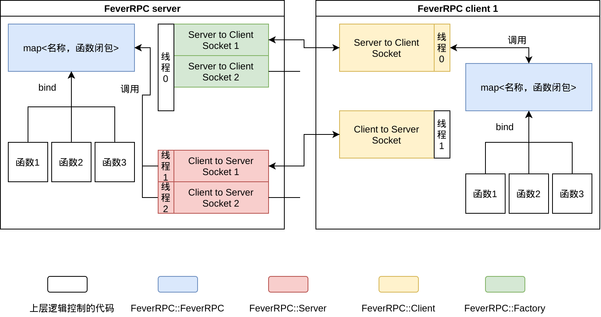

CIYACA-开发文档
~~~~~~~~~~~~~~~~~~~~~~~~

.. toctree::
  :maxdepth: 6

简介
==================

CIYACA 是什么
------------------

.. figure:: ./_static/logo.png

// REPO?

CIYACA 是为北京理工大学《2020年春季Linux 系统编程》大作业而开发的聊天+ BBS 软件，
包括服务端和客户端，均采用 C/CPP 实现。

为什么叫 CIYACA
------------------

CIYACA 采用递归的命名方式， `CIYACA Is Yet Another Chat App`。

特色与创新之处
===================

- 采用 Github 进行团队协作
- 采用 Sphinx + reStructuredText 进行文档写作
- 使用 RPC 的方式封装了底层通信，提供耦合度极低的双向调用方式

编译环境和使用方式
====================

编译环境
------------------

目录结构
------------------

使用方式
------------------

功能介绍
====================

基本功能
------------------

具体功能
------------------

架构设计
====================

整体架构
------------------

模块设计
------------------

FeverRPC-ng
^^^^^^^^^^^^^^^^^^

FeverRPC-ng 是一个基于 Socket 长连接双向 RPC 框架。

.. note::

  FeverRPC-ng 为 FeverRPC 的重构版，FeverRPC 初版在大三上的时候完成的。

功能
""""""""""""""""""

支持的功能
*****************

- 使用TCP/Socket长连接
- 双向RPC
- 支持任意长度、类型参数绑定
- 基于MsgPack，可自定义序列化类型
- Socket 支持任意大小传输功能 (不超过 int 表示范围的字节数)
- 抛出异常

不支持的功能
******************
- void返回值
- 绑定非静态成员函数

设计目标
""""""""""""""""""

FeverRPC 的设计目标是解决 Socket 通信中客户端和服务端相互调用中的序列化问题。

对于一般程序来说，传统的做法是使用序列化库，每增加一个接口，就需要增加相应的转换代码和序列化、反序列化代码。
然而这对于程序开发显然是个重复而低效的过程，我们可以使用更抽象的方式完成这一功能。

因此，FeverRPC 旨在为客户端和服务端提供如下的通信接口：

.. code-block::
  
  // Client.cpp

  #include "feverrpc.hpp"

  int main(){
      FeverRPC::Client rpc("127.0.0.1");

      // 调用远程的方法
      int ans = rpc.call<int>("add", 1, 2, 3);
  }

.. code-block::

  // Server

  #include "feverrpc.hpp"

  int add(int a, int b, int c){
      return a + b + c;
  }

  int main(){
      FeverRPC::Server rpc;

      // 绑定方法
      rpc.bind("add", add);
      // 监听调用
      rpc.c2s();
  }

可以见到，对于服务端和客户端来说，只需要将自己给对方提供的逻辑绑定，
然后调用者就可以像使用普通函数调用一样，调用远程的逻辑。

为了满足丰富的函数和变量类型，我们也需要提供 **可变长** 的参数调用。

模块架构
""""""""""""""""

  FeverRPC 模块架构

:FeverRPC\:\:FeverRPC: *处理函数绑定和函数闭包调用的数据结构和逻辑代码*

  RPC 通信的本质在于事先绑定需要调用的函数，以便在以后的任意时间取出并调用。
  不过如果仅仅是绑定固定参数的函数还不够，我们需要用 CPP 来提供支持任意参数函数
  绑定的功能。这些都由 `FeverRPC::FeverRPC` 实现。

:FeverRPC\:\:Server: *服务端用来监听所有来此客户端的调用的模块*

  封装了服务端监听所用客户端发起通信、主动调用的 Socket 代码。
  通过多线程来处理多个客户端。内部调用 `FeverRPC::FeverRPC` 。

:FeverRPC\:\:Client: *客户端用来监听/调用服务端的模块*

  封装了客户端连接服务端的 Socket 代码，并且使用一个线程监听
  来自服务端的调用。同时也可以主动调用服务端函数。内部调用 `FeverRPC::FeverRPC` 。

:FeverRPC\:\:Factory: *服务端主动调用客户端函数的句柄*

  封装了客户端连接服务端的 Socket 代码，并且返回给上层调用
  一个可以调用客户端函数的句柄。具体的使用方式由上层代码实现。

:上层逻辑控制代码: *客户端/服务端的逻辑代码*

  这些代码又上层实现，在实现的过程中，完全可以屏蔽底层的 Socket 的传输机制。
  在不影响功能的情况下，最大程度上解耦模块。

绑定-执行机制设计
""""""""""""""""""""

RPC 通信需要双方首先绑定可以使用的函数，然后延迟调用。
简单来说，就是使用一个类似 `map<String, Function>` 的映射来
存储这些函数。

在执行的时候，使用根据相应的名称从这个映射中取出函数，并传入参数执行就可以了。

任意类型不定长参数设计
""""""""""""""""""""""""

如果仅仅需要绑定和执行，直接使用强制类型转换将函数参数统一成 `void *` 的方式就行了。
但是我们有一个问题出现了，在双方通信时，变量的类型是无法传递的。如果采用 `void *` 的方式
只能由上层代码将类型强制转换成需要的类型——这样增加了上层代码的工作。

所以我们需要能够在无法泛型的 `map` 中存储函数的类型，也就是让类型变成可以存储的数据。
这就要使用 c++11、c++14 引入的 tuple、变长参数模板、函数参数绑定等功能。简单来说，
这些功能能让我们将参数和返回值的数据类型一同存入 `map` 中。并在需要取回的时候，通过这部分信息
来反序列化传入的参数（以及序列化返回的返回值），保证了 RPC 过程中函数类型的自动转换。

.. note::
  
  具体的代码比较长，详见源码。

任意长数据传送设计
""""""""""""""""""""""""

为了传输不定长的数据，我们需要对于每一个发送的数据，首先传送数据大小，然后按照 1024 字节
分块传送数据。接收端也按照同样的逻辑接受。

Debug 与错误处理设计
""""""""""""""""""""""

为了方便调试，我们可以采用宏定义 + 宏函数的方式自定义 Debug 函数。

.. code-block:: c

  #ifdef DEBUG
  #define dbgprintf(format, args...)                                               \
      printf("[%s,%s,%d] " format "\n", __FILE__, __FUNCTION__, __LINE__, args)
  #define dbgputs(string)                                                          \
      printf("[%s,%s,%d] " string "\n", __FILE__, __FUNCTION__, __LINE__)
  #else
  #define dbgprintf(format, args...)                                               \
      {}
  #define dbgputs(string)                                                          \
      {}
  #endif

这样当我们在 make 的时候传入 `-DDEBUG` flag，就能编译出打印调试信息的代码，
并且每个输出都有文件名、行号、函数名。

双向调用设计
""""""""""""""""""""""""

为了满足交互需求，RPC 不仅仅需要类似 HTTP 的单向无状态请求的方式；还需要提供
从服务端调用客户端的能力（并且在此之上保证能够记忆客户端的身份）。

经管对于 Socket 协议来说，这一切是很好实现的，但是不要忘记我们将 Socket 完全封装了。
因此，上层代码在编译期是无法提前知道这个 RPC 和哪个客户端对应。

:双向调用:
  
  这需要采用两个 Socket 进行通信，分别负责客户端主动发起的调用和服务端主动发起的调用。
  当然，如果采用异步 IO 也可以使用一个 Socket 解决，但是这样需要严格设计消息缓冲的序列，
  会增加较大的工作量、增加调试难度。

:有状态的服务:

  详见 // TODO：链接

  

依赖
""""""""""""""""""

运行依赖
************************

- msgpack
- c++17 (因为使用了 `std::apply`)
- Linux 操作系统

涉及的 Linux 系统调用
*************************

开发者注意事项
""""""""""""""""""

.. warning::

  如果你是一名开发者，这里的内容需要你认真阅读。

为什么你需要它
****************************
why should I use it
你能获得的优势：

在开发阶段，不在需要协商底层通信内容，只需要协商回调函数的接口（可以完全忽略网络传输的问题）。
如果有新增的数据类型，不需要对底层的通信接口进行改动，只需要双方协商好字段和类型就可以。

解决双向调用的身份识别问题
*******************************

在使用双向的 RPC 中会遇到一个棘手的问题，就是在服务端作为 Caller 的代码没有办法知道对应的 Callee 是哪个。 
比如当设计即时通信的服务时，自己 bind 的代码被调用了以后，并不能分清楚要将消息发给哪些 RPC 的对端。

在想了很长时间后我发现这个问题还是需要交给通信协议（交互逻辑）去实现。简单来说， 只要满足以下两条要求就可以获得足够的信息，保证双向调用不会遇到身份认证问题。

1. 客户端除了 login，其他的方法必须首先传入能够标识唯一 ID 的参数信息。
2. 服务端在获得 S2C 的 RPC 连接后，会立刻调用 getID 来获取上一个要求中同样的 ID 信息。

这样，在业务上足够完成身份的绑定，以便后续的操作。

鸣谢
""""""""""""""""""""

https://github.com/button-chen/buttonrpc_cpp14
- 感谢 button-rpc 给予了我最关键的知识点
- Blogs you can find on Google Search

困难与解决办法
========================

分工和人员合作
====================

分工
------------------

合作
------------------

会议记录
^^^^^^^^^^^^^^^^^^

