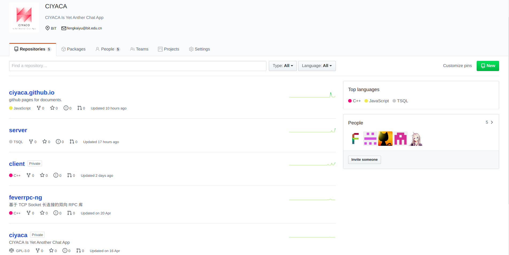
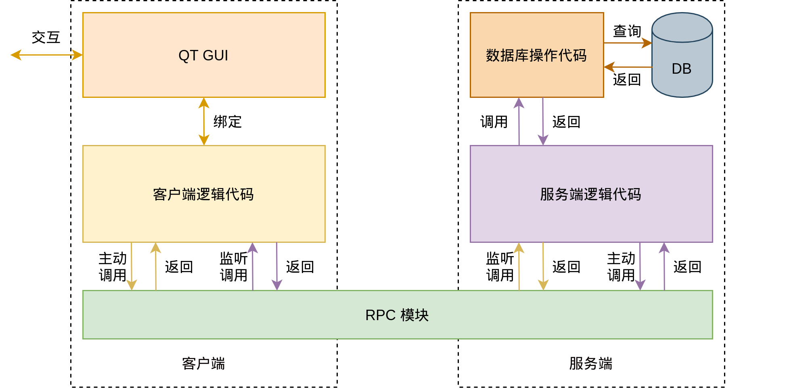
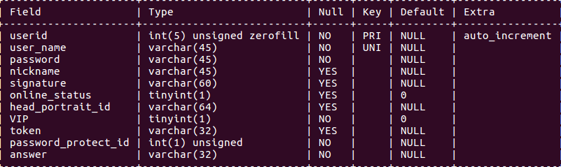
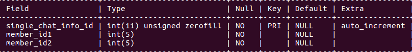
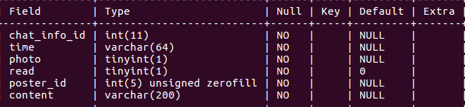
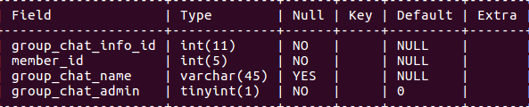
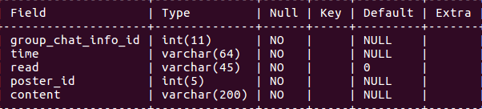
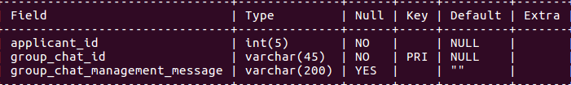
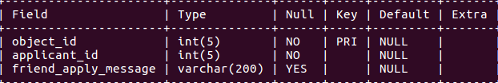

CIYACA-开发文档
~~~~~~~~~~~~~~~~~~~~~~~~

.. toctree::
  :maxdepth: 6

简介
==================

CIYACA 是什么
------------------

.. figure:: ./_static/logo.png
  
  我们设计的 LOGO

CIYACA 是为北京理工大学《2020年春季Linux 系统编程》大作业而开发的聊天+ BBS 软件，
包括服务端和客户端，均采用 C/CPP 实现。

我们的 Github Organization: https://github.com/ciyaca

  代码仓库

为什么叫 CIYACA
------------------

CIYACA 采用递归的命名方式， `CIYACA Is Yet Another Chat App` 。

特色与创新之处
===================

- 专门设计了 Logo、名称
- 采用 Github 进行团队协作
- 采用 Sphinx + reStructuredText 进行文档写作
- 采用石墨文档进行共享编辑、整理前期内容
- 设计了美观的界面
  - 有聊天气泡
- 使用 RPC 的方式封装了底层通信，提供耦合度极低的双向调用方式

编译环境和使用方式
====================

编译环境
------------------

目录结构
------------------

使用方式
------------------

功能介绍
====================

基本功能
------------------

.. csv-table:: 基本功能介绍
  :header: "功能名称", "功能介绍"
  :widths: 15, 30

  "联系人树状显示", "将所有联系人按照好友与群组分成两类以树状结构进行呈现。"
  好友请求处理, 主要用于处理好友申请，选择同意或拒绝，并与服务器完成信息交互后删除该请求。 
  单聊, 进行单人聊天。
  历史消息, 登录后，服务端会将历史消息发送至客户端，客户端重新渲染聊天记录。
  表情包发送, 可发送动态表情包。
  文件发送, 可发送图片等文件，发送时聊天界面中间有进度条显示进度。
  添加好友/群组,输入好友名称或群组名称，服务器将返回处理结果，存在该用户则可发送好友请求。
  创建群组,输入群组名称，服务器查询无重复即可创建群组。
  群聊, 进行群组聊天。
  BBS 发帖,可进行论坛聊天。
  BBS 评论,可进行论坛评论。
  BBS 文件上传,可以上传文件到论坛。
  BBS 文件下载,可以从论坛上下载文件。

具体功能
------------------

登录、注册界面
^^^^^^^^^^^^^^^^^^^

.. list-table:: 登录、注册界面
  :header-rows: 1

  * - 截图
    - 描述

  * - .. figure:: ./_static/feature-login-1.png
        :figwidth: 300px
        :align: left
    - 登录界面

  * - .. figure:: ./_static/feature-login-2.png
        :figwidth: 300px
        :align: left
    - 注册界面

  * - .. figure:: ./_static/feature-login-3.png
        :figwidth: 300px
        :align: left
    - 密码的隐藏与显示
  
处理好友申请
^^^^^^^^^^^^^^^

.. list-table:: 处理好友申请
  :header-rows: 1

  * - 截图
    - 描述

  * - .. figure:: ./_static/feature-friend-3.png
        :figwidth: 300px
        :align: left
    - 添加好友（或者群组）

  * - .. figure:: ./_static/feature-friend-1.png
        :figwidth: 300px
        :align: left
    - 同意好友请求
  
  * - .. figure:: ./_static/feature-friend-2.png
        :figwidth: 300px
        :align: left
    - 左侧好友列表中，新的好友已经添加
  

单聊与群聊
^^^^^^^^^^^^^^

.. list-table:: 单聊与群聊
  :header-rows: 1

  * - 截图
    - 描述

  * - .. figure:: ./_static/feature-chat-1.png
        :figwidth: 300px
        :align: left
    - 单聊

  * - .. figure:: ./_static/feature-chat-2.png
        :figwidth: 300px
        :align: left
    - 创建群组
      
      
  * - .. figure:: ./_static/feature-chat-3.png
        :figwidth: 300px
        :align: left
    - 联系人树状显示

BBS 论坛
^^^^^^^^^^^^^^
 
.. list-table:: BBS 论坛（1）
  :header-rows: 1
  :widths: 30 25

  * - 截图
    - 描述

  * - .. figure:: ./_static/feature-bbs-1.png
        :figwidth: 300px
    - 进入 BBS 论坛

  * - .. figure:: ./_static/feature-bbs-2.png
        :figwidth: 300px
    - 点击 `new post` 按钮调出编辑窗口，编辑窗口中的 `attach file` 按钮允许用户添加附件。编辑之后点击发送按钮即可在BBS界面看到新发的帖子以及附件。

  * - .. figure:: ./_static/feature-bbs-3.png
        :figwidth: 300px
    - 同上

.. list-table:: BBS 论坛（2）
  :header-rows: 1
  :widths: 30 25

  * - 截图
    - 描述

  * - .. figure:: ./_static/feature-bbs-4.png
        :figwidth: 300px
    - 点击对应帖子的 `comment` 按钮即可实现评论。

  * - .. figure:: ./_static/feature-bbs-5.png
        :figwidth: 300px
    - 在发帖子时点击 `attach file` 即可上传文件。

  * - .. figure:: ./_static/feature-bbs-6.png
        :figwidth: 300px
    - 点击文件名，即可从服务器下载文件。文件默认存储在用户家目录下的 `.client` 隐藏文件夹。

文件传送
^^^^^^^^^^^^^^
 
.. list-table:: 文件传送
  :header-rows: 1

  * - 截图
    - 描述

 
  * - .. figure:: ./_static/feature-file-1.png
        :figwidth: 300px
    - 传送一个图片

架构设计
====================

整体架构
------------------

   系统架构
  
如 :numref:`system-architect` 所示，系统架构分为五个主要的部分（每个模块的具体设计将在下面章节详述）:

TODO

- QT GUI 模块， 与用户交互并调用底层通讯。详见 `界面设计`_ 。
- 客户端逻辑代码模块，提供客户端应用逻辑。详见 `客户端设计`_ 。
- 双向 RPC 调用模块，将网络通信封装成函数调用。详见 `网络通信 —— FeverRPC-ng`_ 。
- 服务端逻辑代码模块，提供服务端应用逻辑。详见。
- 数据库调用模块，提供数据持久化支持。详见 `数据库的设计与建立`_ 。

*注意模块之间的通讯形式各不相同。*

模块设计
------------------

界面设计
^^^^^^^^^^^^^^^^^^

本小节讨论客户端的界面设计。

编译环境
""""""""""""""""""

:操作系统: Ubuntu 18.04
:工具:  Qt 5.14.1

注册界面设计思路
""""""""""""""""""

该界面模仿与TIM的登录界面，元素包含logo,登录账号输入框，
登录密码输入框，登录按钮，注册按钮，注册账号输入框，
注册密码输入框、注册密码确认框以及返回按钮，使用Qt自带的ui编辑器对其进行整理。

**细节设计** ：

- 为了避免出现两个窗口，使用QStackedWidget控件来生成两个页面，使用按钮进行切换。点击注册按钮，则出现注册界面，点击返回按钮，则返回到登录界面。
- 为了界面美化，对输入框样式进行了设计，鼠标越过以及点击出现不同颜色，表示选中，同时将框体的四个角变成圆弧，更加接近TIM界面。
- 密码隐藏与展示。在密码输入框的右侧设置一个按钮，来完成密码的隐藏与展示的切换。
- Logo显示，使用label在界面左边显示logo。

主体界面设计思路
""""""""""""""""""
为了做出一个比较好的主体界面，这里也是模仿TIM进行相关设计，
主界面需要展现用户的名字以及头像等信息，然后需要三个子界面：
聊天界面，联系人界面以及BBS界面。这里使用QtabWidget进行分页，分成三个主页面。 

:头像以及名字: 

  当用户成功登陆后，服务器会返回一系列信息，其中包括用户的账户以及头像标签，当前端收到这些信息，将会使用对应Qlabel进行呈现。

:聊天界面设计: 

  类似TIM，聊天界面左边一栏将会出现一个简略的来信信息，右边则是聊天主体界面。对于左边来信消息的实现则是使用QlistWidget类进行呈现，每出现一个新的用户来信，则会在左边新建一行，随即建立对应的聊天主体界面。

  在聊天界面中，最上面一行则是交互信息用户名，然后接着便是消息呈现界面，最下面则是消息发送框，其中增设消息记录，表情包以及文件传输三个按钮，中间还有文件传输进度条的呈现，显示当前文件传输状态。

:联系人界面:

  类似TIM，左边是联系人树状显示，另加上一个添加好友的按钮，在界面实现过程中没有像图中一样分为好友以及群组抽屉，而是放一起，也就是说，左边只有两个分组，一个是“我的好友”，一个是“我的群组”，使用button空间生成一个按钮，完成添加好友/群组功能。对于界面右边，则呈现的是加好友信息的来信提醒。

:添加好友或群组:

  该界面仅有一个输入框，当输入需要添加的用户名称，服务器将会处理请求。

:创建群聊:

  该界面也是仅有一个输入框，输入需要创建的群聊名称，服务器处理请求后返回结果。

:好友申请界面:

  该界面与用户联系人界面在一起，使用QListWidget维护着一个请求列表。对于每一个好友请求，将呈用户头像、用户名以及申请理由，同时设置有同意、拒绝按钮，这些按钮绑定对应的函数与服务端进行交互，一同处理请求。值得注意的是，当点击同意或拒绝后，该请求将从列表中中删除，同时更新请求列表。

客户端设计
^^^^^^^^^^^^^^^^^

本小节讨论客户端的界面逻辑设计。

功能区设计
""""""""""""""""""

客户端设计分为三大块：发帖和刷新按钮功能区、BBS显示区、帖子编辑区。

功能区实现的是发帖和刷新功能，点击刷新可以获取最新发布的帖子并在BBS显示区显示。点击发帖按钮可以调出编辑区。

在Qt中，得益于 `connect` 通信机制，点击按钮可以自动新建编辑窗口。编辑窗口由 `send` 和 `attach file` 两个按钮组成的功能区和 `textEditor` 组成的编辑区组成。在编辑区运行输入任意文本；点击 `attach file` 可以调用文件系统窗口进行浏览搜索需要发送的文件。在点击 `send` 按钮之后，先发送文件到服务器，再发送帖子内容到服务器，完成整个发送过程。

点击 `refresh` 按钮之后，要求服务器返回帖子内容，BBS客户端对内容进行解析，将其显示到界面上。客户端界面使用了 `scroll area` 实现，如果帖子数目过长过多，可通过鼠标滚轮向下翻滚。

帖子打包
""""""""""""""""""""""

由于一个帖子涉及用户名、帖子内容、附件、评论等信息，对帖子的解析就很关键。

规定一个帖子的基本内容封装如下,受益于html格式的封装的启发，依照规定进行封装。

.. code-block:: xml

	<li>//每个帖子使用li进行封装
		
1024
//post id
		
pipixia
//发帖人
		
为了在文本框中显示字符串，我们常用这样两个函数实现
//帖子内容
        
1
//附件数量
		

//附件ID号
        
测试.txt
//附件文件名
		
pipixia
//评论者昵称
		

//评论者回复的对象
		
今天好开心呀
//评论内容
		
0
//评论者发送的附件数量
		
董斌
//第二个评论者昵称
		

//第二个评论者回复的对象
		
我喜欢你
//评论内容
		
1
//第二个评论者发送的附件的数量
		

//附件ID号
		
爱心.gif
//附件文件名
	</li>
        <li>
                ...//第二个帖子的内容
        </li>

帖子解析
""""""""""""""""""

帖子内容是格式化的，因此给帖子内容解析带来了方便。下面对帖子内容进行解析：

1. 将获取到的数个帖子 `<li></li>` 封装格式进行拆分为单个帖子
   * 为每个帖子生成一个 `QWidget *post` ，用于存储接下来的内容
2. 获取用户昵称，第二个 `

` 的内容
   * 每个用户信息生成一个 `QWidget *user_info` 包含用户名、用户头像
   * 在用户信息的右侧添加 `comment` 按钮，以便于对该帖子进行评论
3. 获取帖子内容，第三个 `

` 的内容
   * 生成一个 `QLabel` 保存帖子内容
4. 查询帖子附件个数，第四个 `

` 的内容
5. 根据附件个数查询附件，每两个 `

` 的内容表示一个附件
   * 每查询到一个附件，就生成一个 `QPushButton` ，用于响应下载请求。
6. 接下来的 `

` 的内容就是评论内容，其解析方式与帖子解析类似。

网络通信 —— FeverRPC-ng
^^^^^^^^^^^^^^^^^^^^^^^^^^^

FeverRPC-ng 是一个基于 Socket 长连接双向 RPC 框架。

.. note::

  FeverRPC-ng 为 FeverRPC 的重构版，FeverRPC 初版在大三上的时候完成的。

功能
""""""""""""""""""

支持的功能
*****************

- 使用TCP/Socket长连接
- 双向RPC
- 支持任意长度、类型参数绑定
- 基于MsgPack，可自定义序列化类型
- Socket 支持任意大小传输功能 (不超过 int 表示范围的字节数)
- 抛出异常

不支持的功能
******************
- void返回值
- 绑定非静态成员函数

设计目标
""""""""""""""""""

FeverRPC 的设计目标是解决 Socket 通信中客户端和服务端相互调用中的序列化问题。

对于一般程序来说，传统的做法是使用序列化库，每增加一个接口，就需要增加相应的转换代码和序列化、反序列化代码。
然而这对于程序开发显然是个重复而低效的过程，我们可以使用更抽象的方式完成这一功能。

因此，FeverRPC 旨在为客户端和服务端提供如下的通信接口：

.. code-block::
  
  // Client.cpp

  #include "feverrpc.hpp"

  int main(){
      FeverRPC::Client rpc("127.0.0.1");

      // 调用远程的方法
      int ans = rpc.call<int>("add", 1, 2, 3);
  }

.. code-block::

  // Server

  #include "feverrpc.hpp"

  int add(int a, int b, int c){
      return a + b + c;
  }

  int main(){
      FeverRPC::Server rpc;

      // 绑定方法
      rpc.bind("add", add);
      // 监听调用
      rpc.c2s();
  }

可以见到，对于服务端和客户端来说，只需要将自己给对方提供的逻辑绑定，
然后调用者就可以像使用普通函数调用一样，调用远程的逻辑。

为了满足丰富的函数和变量类型，我们也需要提供 **可变长** 的参数调用。

模块架构
""""""""""""""""

.. figure:: ./_static/FerverRPC_arch.png

  FeverRPC 模块架构

:FeverRPC\:\:FeverRPC: *处理函数绑定和函数闭包调用的数据结构和逻辑代码*

  RPC 通信的本质在于事先绑定需要调用的函数，以便在以后的任意时间取出并调用。
  不过如果仅仅是绑定固定参数的函数还不够，我们需要用 CPP 来提供支持任意参数函数
  绑定的功能。这些都由 `FeverRPC::FeverRPC` 实现。

:FeverRPC\:\:Server: *服务端用来监听所有来此客户端的调用的模块*

  封装了服务端监听所用客户端发起通信、主动调用的 Socket 代码。
  通过多线程来处理多个客户端。内部调用 `FeverRPC::FeverRPC` 。

:FeverRPC\:\:Client: *客户端用来监听/调用服务端的模块*

  封装了客户端连接服务端的 Socket 代码，并且使用一个线程监听
  来自服务端的调用。同时也可以主动调用服务端函数。内部调用 `FeverRPC::FeverRPC` 。

:FeverRPC\:\:Factory: *服务端主动调用客户端函数的句柄*

  封装了客户端连接服务端的 Socket 代码，并且返回给上层调用
  一个可以调用客户端函数的句柄。具体的使用方式由上层代码实现。

:上层逻辑控制代码: *客户端/服务端的逻辑代码*

  这些代码又上层实现，在实现的过程中，完全可以屏蔽底层的 Socket 的传输机制。
  在不影响功能的情况下，最大程度上解耦模块。

绑定-执行机制设计
""""""""""""""""""""

RPC 通信需要双方首先绑定可以使用的函数，然后延迟调用。
简单来说，就是使用一个类似 `map<String, Function>` 的映射来
存储这些函数。

在执行的时候，使用根据相应的名称从这个映射中取出函数，并传入参数执行就可以了。

任意类型不定长参数设计
""""""""""""""""""""""""

如果仅仅需要绑定和执行，直接使用强制类型转换将函数参数统一成 `void *` 的方式就行了。
但是我们有一个问题出现了，在双方通信时，变量的类型是无法传递的。如果采用 `void *` 的方式
只能由上层代码将类型强制转换成需要的类型——这样增加了上层代码的工作。

所以我们需要能够在无法泛型的 `map` 中存储函数的类型，也就是让类型变成可以存储的数据。
这就要使用 c++11、c++14 引入的 tuple、变长参数模板、函数参数绑定等功能。简单来说，
这些功能能让我们将参数和返回值的数据类型一同存入 `map` 中。并在需要取回的时候，通过这部分信息
来反序列化传入的参数（以及序列化返回的返回值），保证了 RPC 过程中函数类型的自动转换。

.. note::
  
  具体的代码比较长，详见源码。

任意长数据传送设计
""""""""""""""""""""""""

为了传输不定长的数据，我们需要对于每一个发送的数据，首先传送数据大小，然后按照 1024 字节
分块传送数据。接收端也按照同样的逻辑接受。

Debug 与错误处理设计
""""""""""""""""""""""

为了方便调试，我们可以采用宏定义 + 宏函数的方式自定义 Debug 函数。

.. code-block:: c

  #ifdef DEBUG
  #define dbgprintf(format, args...)                                               \
      printf("[%s,%s,%d] " format "\n", __FILE__, __FUNCTION__, __LINE__, args)
  #define dbgputs(string)                                                          \
      printf("[%s,%s,%d] " string "\n", __FILE__, __FUNCTION__, __LINE__)
  #else
  #define dbgprintf(format, args...)                                               \
      {}
  #define dbgputs(string)                                                          \
      {}
  #endif

这样当我们在 make 的时候传入 `-DDEBUG` flag，就能编译出打印调试信息的代码，
并且每个输出都有文件名、行号、函数名。

双向调用设计
""""""""""""""""""""""""

为了满足交互需求，RPC 不仅仅需要类似 HTTP 的单向无状态请求的方式；还需要提供
从服务端调用客户端的能力（并且在此之上保证能够记忆客户端的身份）。

经管对于 Socket 协议来说，这一切是很好实现的，但是不要忘记我们将 Socket 完全封装了。
因此，上层代码在编译期是无法提前知道这个 RPC 和哪个客户端对应。

:双向调用:
  
  这需要采用两个 Socket 进行通信，分别负责客户端主动发起的调用和服务端主动发起的调用。
  当然，如果采用异步 IO 也可以使用一个 Socket 解决，但是这样需要严格设计消息缓冲的序列，
  会增加较大的工作量、增加调试难度。

:有状态的服务:

  详见 `解决双向调用的身份识别问题`_

  

依赖
""""""""""""""""""

运行依赖
************************

- msgpack
- c++17 (因为使用了 `std::apply`)
- Linux 操作系统

涉及的 Linux 系统调用
*************************

开发者注意事项
""""""""""""""""""

.. warning::

  如果你是一名开发者，这里的内容需要你认真阅读。

为什么你需要它
****************************
why should I use it
你能获得的优势：

在开发阶段，不在需要协商底层通信内容，只需要协商回调函数的接口（可以完全忽略网络传输的问题）。
如果有新增的数据类型，不需要对底层的通信接口进行改动，只需要双方协商好字段和类型就可以。

解决双向调用的身份识别问题
*******************************

在使用双向的 RPC 中会遇到一个棘手的问题，就是在服务端作为 Caller 的代码没有办法知道对应的 Callee 是哪个。 
比如当设计即时通信的服务时，自己 bind 的代码被调用了以后，并不能分清楚要将消息发给哪些 RPC 的对端。

在想了很长时间后我发现这个问题还是需要交给通信协议（交互逻辑）去实现。简单来说， 只要满足以下两条要求就可以获得足够的信息，保证双向调用不会遇到身份认证问题。

1. 客户端除了 login，其他的方法必须首先传入能够标识唯一 ID 的参数信息。
2. 服务端在获得 S2C 的 RPC 连接后，会立刻调用 getID 来获取上一个要求中同样的 ID 信息。

这样，在业务上足够完成身份的绑定，以便后续的操作。

鸣谢
""""""""""""""""""""

- 感谢 button-rpc_ 给予了我最关键的知识点
- 其他能在搜索引擎上找到的相关教程

.. _button-rpc: https://github.com/button-chen/buttonrpc_cpp14

数据库的设计与建立
^^^^^^^^^^^^^^^^^^^^^^^^^^^^

根据最初的需求分析，我们的数据库需要记录好友的申请信息、好友信息、群聊聊天记录、群聊信息、群聊的申请信息、头像信息、私聊记录、私聊信息、未读消息以及每一个账号的信息等，故在设计数据库时设计了friend_apply、friend_info等表，下面将叙述数据库部分重要表的详细信息。

User 表
""""""""""""""""""""""""""""

User_id代表着账号的唯一索引，有了这一项便能够允许用户给账号创建昵称时能够任意创建而不需考虑重名的问题。

User_name是账号的用户名，同样是账号的唯一索引。

Password是账号的密码，最高支持45位字符。

Signature是账号的个人签名，可以置空。

Online_status是账号的在线状态，可以用来标注好友列表中的在线状态。

Head_portait_id记录着账号的头像，目前头像仅仅是服务器端提供一些预设的图片，不支持用户自定义。

single_chat_info表
""""""""""""""""""""""""""""

该表利用single_chat_info_id记录了所有有聊天记录的私聊信息以及私聊双方的user_id，便于之后检索聊天信息。

single_chat_history表
""""""""""""""""""""""""""""""

该表利用chat_info_id与single_chat_info进行连接，可以获得聊天双方的user_id。

time、read、poster_id、content记录了该条信息的时间、已读情况、发送者id以及内容，内容长度被设定为不超过200位字符。

group_chat_info表
""""""""""""""""""""""""""""""

该表设置了group_chat_info_id作为群聊的唯一索引，群聊管理者可以更改群聊的名称以及任命管理者。

该表将通过记录加入者的user_id，与user表进行连接后便能够获取到所有群聊成员的信息。

group_chat_history表
""""""""""""""""""""""""""""""

该表同样利用group_chat_info_id作为消息记录的检索方式，使用group_chat_info_id可以查询到该群聊的所有历史信息。

time、read、poster_id、content记录了某一条信息的时间、已读情况、发送者id和信息的内容。

group_chat_management表
""""""""""""""""""""""""""""""

该表用来记录每个群聊的申请者信息，申请者可以通过group_chat_management_message来向群聊的管理者发出加入群聊的申请信息，管理者审核通过后便将该申请者加入群聊。

friend_apply表
""""""""""""""""""""""""""""""

该表用来记录用户好友申请信息，object_id代表被申请者的user_id，applicant_id代表申请者的user_id。

申请者可以通过friend_apply_message向被申请者发出好友申请信息，被申请者审核通过后便可以添加为好友。

困难与解决办法
========================

解决双向 RPC 设计中可变长模板参数的设计
--------------------------------------------

难点
^^^^^^^^^^^^^^^

**如何不仅传递数值信息，并且传递类型信息以及根据类型信息自动反序列化** ，是这个 RPC 的最大难点之一。

可变长参数模板的概念实际上是超出一个普通 C/CPP 使用者的认知的。
因为对于传统的编译型语言来说，人们的认知都是：“除了虚函数以外，很难实现运行时多态“。

比如 C 语言中的 `printf` ，虽然支持可变长参数，并且看上去类型任意。但其实这些参数
的类型信息在传递的时候已经被丢弃了，只按照大小压栈。这也是为什么前面还需要用控制字符串
来说明当前变量的信息类型。

而只有在动态语言中，才会有 `print(1, "a", [1,2,3])` 这种不需要提供参数类型信息的方式。
（ `cout << 1 << "a";` 这种相当与多次调用同一个函数，不在我们讨论范围之内）。

所以一开始为了实现我们的动态的 RPC 调用接口，我花了很长时间去考虑该选择怎样的技术来完成它。
也就是，类型信息怎么在网络通信中传输。

原始的方式之所以总需要根据接口修改，就是因为双方通信的时候并没有传递类型信息；或者说这部分
类型信息没有在接收方被正确利用，所以需要双方实现约定好格式的序列化和反序列换。但是我们的希望是:
传递类型信息，并且在接收方动态地反序列化（我们不手动判断）。

解决方法
^^^^^^^^^^^^^^^

还好有可变长参数模板这一概念，以及 CPP11/14/17 中对类型提供的支持，它能够让我们使用  `std::tuple`
类型来装载 Template 中的类型信息。并且通过多级的模板参数展开，我们能够还原其中的类型。

然而这一系列知识以及代码实现还是非常复杂，我用了大概 3 天 × 4 个小时的时间写了两遍，并且参考了一些
网上对于这部分知识的实验性代码，才最终有了今天这版 RPC 的动态参数调用实现。

解决双向 RPC 调用中身份认证的问题
------------------------------------

难点
^^^^^^^^^^^^^^^^^

这版 FeverRPC-ng 是基于大三上完成的初版的进一步重构。在我大三上完成整体设计的时候，
就已经因为这个问题十分头痛。

身份认证的问题是这样的：RPC 调用依赖实现注册的函数，服务端和客户端相互调用属于两个线程。
而如果想在服务端绑定的函数中调用某个具体的 Server to Client 的 RPC 句柄，就会遇到无法确认
具体是哪个句柄的问题。

最初为了解决这个问题。我曾经试图把认证逻辑封装在了 RPC 之中，但是实事证明这样限制了灵活度，
也让 RPC 承担了更复杂而多余的逻辑功能。

解决方法
^^^^^^^^^^^^^^^^^^^^^^^^^^^^^

既然代码层面不好约束，在很长时间思考以后，我最终选择了从协议层面入手。

也就是说使用这个 RPC 的上层代码要满足以下的协议要求：

1. 客户端除了 login，其他的方法必须首先传入能够标识唯一 ID 的参数信息。
2. 服务端在获得 S2C 的 RPC 连接后，会立刻调用 getID 来获取上一个要求中同样的 ID 信息。

这样能够保证，首先建立连接的时候服务端就能将句柄和 ID 一一对应，然后在之后的通讯中，
客户端都会提供 ID 来保证服务端能够区分。

这样这个问题就能够比较完美的解决（除了增加性能开销，不过不大）。

数据库设计方面
---------------------

作为一名数据库设计与开发者，体会到了在实际的项目开发中，数据库作为最为基础的一个功能，在各个功能的实现中都有涉及。在数据库设计的过程中，我遇到了各种各样的问题，比如各个表间同一字段取名不同导致使用不方便、主键设置不当导致无法插入多条聊天记录……让我体会到设计出一个稳定的数据库是一件非常困难的事情。

对接问题
-------------------

难点
^^^^^^^^^^^

在客户端设计与后端设计分离的情况下验证客户端开发是否正确就成了一个问题，同时当后端开发完毕在进行对接过程中会存在细节对接不上的情况。

解决方法
^^^^^^^^^^^^^^^^^^^

采用软件测试中打桩的方法，在需要借助后端进行通信的模块一律转为对文件的操作，这样可以向外留有对接接口，在与后端的对接的过程中，只需要将数据流从文件转为与后端的socket连接的数据流即可。同时，在设计过程中会先于后端商议好信息交流的方向和过程，这样即使在实际开发中由于开发实际情况原因使得开发接口改变也只需简单修改接口即可，无需对内部实现函数进行大的修改，因为实际的处理内容是一致的。

BBS呈现问题
---------------------

难点
^^^^^^^^^^^

一般的BBS都是由网页开发的。由于老师限制了必须使用C进行开发，因此在数据的客户端显示过程中遇到了很多困难。比方说如何显示内容，如何实现数据解析，如何使大量数据在窗口中通过滚动实现顺滑呈现等。

解决方案
^^^^^^^^^^^^^^^^^^^^^

由于使用了QT的框架进行开发，在一定程度上减小了困难程度。

1. 限制呈现的内容

   起初考虑呈现富文本，但是不使用HTML开发渲染的话工作量巨大。因此将数据降维，仅呈现简单的文本信息，附件也以文本链接的形式呈现。

2. 良好的数据封装

   BBS具有丰富的信息：发帖人、评论人、附件、内容等，因此需要对数据进行良好的组织。对数据进行严格的xml格式封装，确保了在信息处理过程中不会出现失误。同时提供了良好的拓展性

3. 帖子与附件分离

   帖子与附件采用不同的数据库进行存储，帖子仅包含指向对应文件的唯一标识，这样当需要下载附件时，通过该唯一标识到数据库检索下载即可。

4. scroll area

   由于帖子内容可能比较多，但是窗口有限，必须要实现翻页功能。起初设计时采用 `QListView` 组件呈现，但是具有明显的撕裂感，观感很差且实际向下翻动效果不好。后更换为 `QScrollArea` 组件进行呈现，达到了类似于网页向下翻滚的效果。

分工和人员合作
====================

分工
------------------

.. csv-table:: 成员分工
  :header: "姓名", "学号", "分工"
  :widths: 15, 15, 30

  董斌, 1120173585, 负责客户端界面的设计和客户端的开发工作，相关文档撰写
  冯开宇, 1120171224, 负责网络通信框架FeverRPC-ng 的开发和维护，相关文档撰写和文档排版，以及项目计划的制定和督促工作
  李昌昊, 1120173304, 李昌昊负责数据库的设计与建立，以及相关Mysql语句编写，相关文档撰写
  王占坤, 1120170124, 负责部分客户端界面的开发和全部客户端接口的编写工作，相关文档撰写
  张剑威, 1120173586, 张剑威负责后端接口的编写以及各个成员之间的协调工作

合作
------------------

我们小组在项目开始通过小组会议的方式实现了对项目的大体分工。

在确定好分工后，会定期开展会议来分享大家的进度以及遇到的问题。同时，小组内部部分成员会不定期讨论来决定一些细节问题，比如接口设计问题，并通过及时沟通解决开发上遇到的冲突。我们项目实现了成员职责的明确界定，项目的每个部分都有对应的负责人。我们重视人际协调和沟通，每个人遇到问题，我们大家都会想办法一起解决。通过我们良好的人员合作，我们最终圆满完成了这个项目。

会议记录
^^^^^^^^^^^^^^^^^^

三月九日
""""""""""""""

:主要内容:

  讨论项目的技术栈，以及明确需求。

:讨论结果:

  我们主要对技术栈进行了分析和选择，比如
  
  - 考虑使用 Rust 来作为后端服务器，稳定性更好
  - 使用 Github 进行代码协作
  - 使用 QT 进行客户端开发 
  - 使用 doxygen 进行 C++ 文档管理
  - 使用 PostgreSQL

  在使用 Rust 的方面我们进行了比较多的讨论，主要是后端的 Rust 其实封装 Linux API 比较多，不太好直接操作 api（因而不是很符合老师的要求）；但是如果采用 C++ + WebSocket 的话，其实自己操作 IO 的部分也很少（会使用大量的库），所以感觉 Rust 并没有不让用。

三月十六日
""""""""""""""
:主要内容:

  确定分工、各自的任务以及下一步的结果。

:讨论结果:

  一开始还是在后端语言的问题上纠结，然后再次向老师确认以后，发现只能用 C/C++ 了。

四月中旬
""""""""""""""""

:进度:

  - GUI：已经有大致的窗体
  - 数据库: 已经有表了
  - RPC: 差不多了，可以进行双向的调用

:更多的分析:

  - 可以尝试 SQLite 减小运行的要求
  - 文档可以开始做了
  - 前后端的逻辑代码可以开始完成了

五月上旬
""""""""""""""

:主要内容:

  是分享目前进度。

  客户端与服务端统一接口。

**后续的会议大多以两、三位成员的规模进行召开，涉及到比较细节的问题。因此不再记录。**
